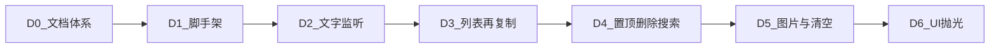

# 执行路线图

原则：**一次只做一个阶段**；上一阶段出口验收通过后再开下一阶段。

## D0 · 文档体系（当前可完成）

| | |
|--|--|
| 入口 | 仓库可写 |
| 工作 | `docs/`、`开发日/`、`cursor.md` |
| 出口 | 标准文件齐全；Agent 能按指引分日推进 |
| 不做 | 任何应用代码 / package.json |

## D1 · 脚手架

| | |
|--|--|
| 入口 | D0 完成 |
| 工作 | Electron + Next 最小窗口能启动 |
| 出口 | 本地打开应用壳（可白屏） |
| 不做 | 剪贴板逻辑、业务 UI |

## D2 · 文字监听

| | |
|--|--|
| 入口 | D1 完成 |
| 工作 | 主进程轮询文字剪贴板 + IPC 推到渲染进程 |
| 出口 | 系统复制文字后，UI 能收到新条目事件（可先 console/简陋展示） |
| 不做 | 图片、置顶删除搜索、精致 UI |

## D3 · 列表与再复制

| | |
|--|--|
| 入口 | D2 完成 |
| 工作 | 时间降序卡片；点击写回剪贴板；去重/冷却 |
| 出口 | 可测「复制 → 出现 → 点击 → Ctrl+V」文字闭环 |
| 不做 | 图片、搜索精修、浅粉抛光 |

## D4 · 置顶 / 删除 / 搜索

| | |
|--|--|
| 入口 | D3 完成 |
| 工作 | 置顶区规则、删除、文字关键词过滤 |
| 出口 | 对照 [01-requirements.md](./01-requirements.md) 中排序/删除/搜索验收 |
| 不做 | 图片监听、退出清空（可留 D5） |

## D5 · 图片与清空

| | |
|--|--|
| 入口 | D4 完成 |
| 工作 | 图片条目与缩略图；24h 丢弃；退出清空 |
| 出口 | 图片再粘贴 + 隐私清空验收通过 |
| 不做 | 多主题、托盘复杂设置 |

## D6 · UI 抛光

| | |
|--|--|
| 入口 | D5 完成 |
| 工作 | 浅粉主题、空状态、边界文案（如图片过大） |
| 出口 | P1 UI 规范达标（见 [03-design-spec.md](./03-design-spec.md)） |
| 不做 | PRD「明确不做」清单内任何项 |

## 阶段切换纪律

1. 在 `cursor.md`「当前阶段」写明 `D*`。
2. 当日 `开发日/YYYY-MM-DD.md` 只列本阶段待办。
3. 未达出口条件，不提前开下一阶段。
